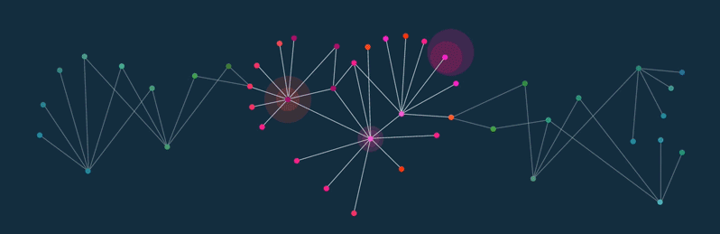

<h2>Hey! 👋, I'm Miguel L Packori! </h2>


- <p><em><i>Currently:</i> Student Programming Technician at University Technology of Cordoba - UTN FRGP. <p><em>
- <i>Previously:</i> Commercial Engineer at University Private of Tacna - UPT. 

<h2>💻 I'm Currently workng on</h2>

- Graphic Design


[](https://twitter.com/ThaiiBraga)
[](https://www.linkedin.com/in/thaianebraga/)
[](https://github.com/Thaiane)


###  A little more about me...  

```javascript
const thai = {
  pronouns: "she" | "her",
  code: [Javascript, Typescript, HTML, CSS, Ruby, Python, Java],
  tools: [React, Redux, Node, Storybook, Styled-Components, Jest, Docker],
  architecture: ["microservices", "event-driven", "design system pattern"],
  techCommunities: {
                        coorganizer: "AfroPython",
                        speaker: "Latinity",
                        mentor: "EducaTRANSforma"
                      },
 challenge: "I am doing the #100DaysOfCode challenge focused on react and typescript"
}
```

 <em><b>I love the truth about the magic of data science<b> and I love connecting with different people</b> so if you want to say <b>hi, I'll be happy to meet you more!</b> :)</em>

---



<!-- <h2 align='center'>Lakshmanan Meiyappan @ Laxmena</h2>
<p align='center'><b>Graduate Student at University of Illinois at Chicago</b></p> -->


__Check out my GitHub repository:__

<div>
  <p>
    <a href="https://github.com/laxmena/PyCalendly">
      
    </a>
    <a href="https://github.com/laxmena/CloudOrg-Simulator">
      
    </a>
  </p>
</div>

<h2>👀 Stats</h2>

<div>
<!--   <p align="center">
    <b><em>Now listening to:</em></b> <br/>
    
  </p> -->
  
  <p align="center">
  <b><em>GitHub Stats:</em></b> <br/>
     <br/><br/>
  <b><em>Programming activity (Last 7 days):</em></b> <br/>
    
  </p>
</div>

<h2> About Miguel L.⚡:</h2>

I'm a Student living in Cordoba, Argentina. Outside Tech, I love to read, enjoy music and explore nature outdoors. If you are around Cordoba, drop an email and let's catch-up over Coffee!
 
- Check out my Blog: [https://laxmena.com](https://laxmena.com)
- Know more about me: [About Laxmena](https://laxmena.com/pages/about)
- Write to me: [codex.nowhere@outlook.com](mailto:codex.nowhere@outlook.com)

<h2>📫 How to reach me:</h2>

<a href="mailto:codex.nowhere@outlook.com"></a> <a href="https://www.linkedin.com/in/luis-m-pacori-67367924a/"></a>
